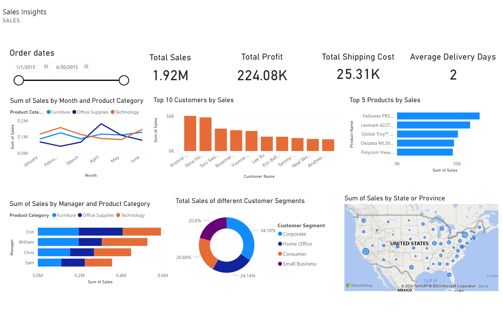

# Sales Insights Dashboard
## Overview:
This problem is related to Retail Industry and its performance.The aim for developing this Dashboard is to find the performance of Supply-chain ,to see the performance of Sales, and to rectify the products that cause loss to the company.

## Goal:
The purpose of a dashboard is to view the most important KPI’s :

- Sales
- Profit
- Average Delivery Days
- Shipping cost
- Product Category
  
Also , develop relative visualizations to learn other trends with the change of the KPIs.

#### This dashboard is developed on Power BI.
## Overview:

## Result:
By viewing this dashboard we can easily understand the performance of the company in Different regions.

## Insights and suggestion:
From the Dashboard we can focus on implementing following points to improve the performance :

Riverside Palais Royal Lawyers Bookcase needs to be stopped as it is Top most Loss products.
Binding Machine generates most sales and is the most prefered by Customer Segment. Most of the profitable products are also bought by Regular air shipment.
The top Locations by sales in united states is east, west and it generally take average of 2 delivery days.

## Key Learnings:
These dashboards provide critical reporting and metrics information and are integral in Business Performance Management.
